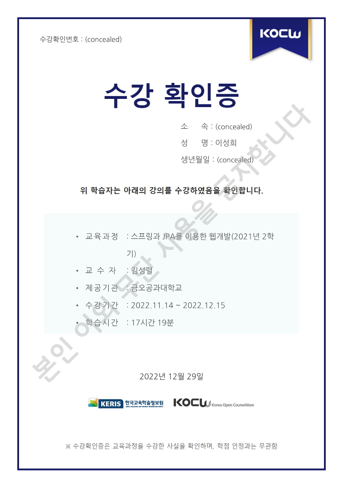

# SeedStarter

> 한국 오픈코스웨어 KOCW의 '스프링과 JPA를 이용한 웹개발'을 수강하며 만든 게시판 프로젝트입니다.

  
*SeedStarer*는 식물을 키우기 시작한 초보 정원사가 관리 일지를 작성할 수 있도록 **게시판 서비스**를 지원합니다.
   

# 사용기술

언어
  * Java

프레임워크
  * Spring boot

빌드 툴
  * Maven

템플릿 엔진
  * Thymeleaf

데이터베이스
  * MySQL

  

# 주요기능

# 구현화면

# 개선사항

# 기타사항

